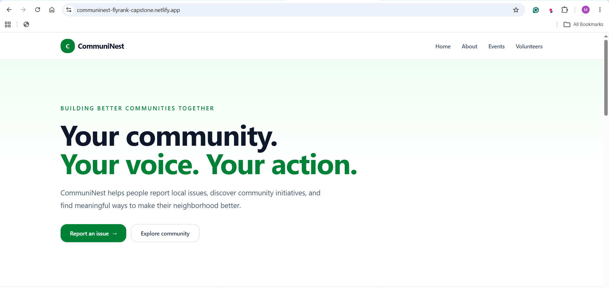
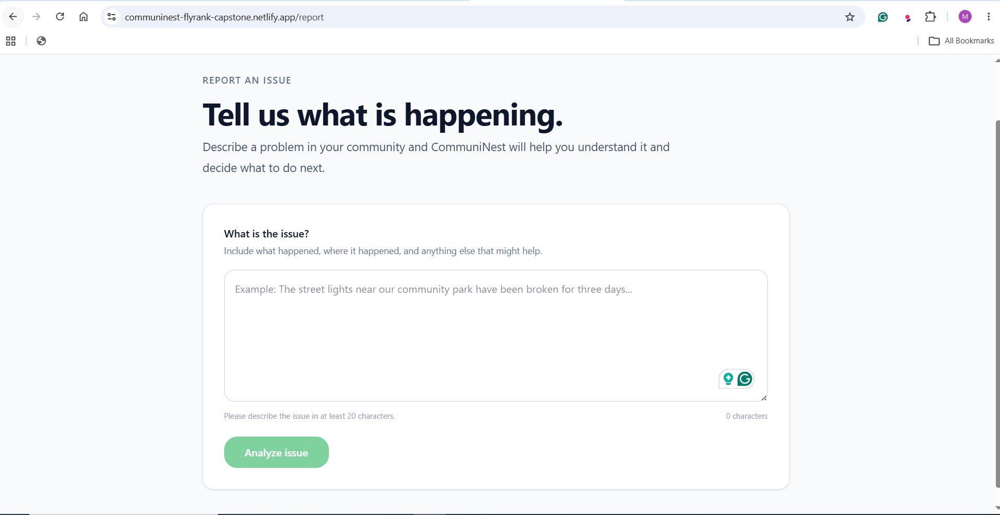
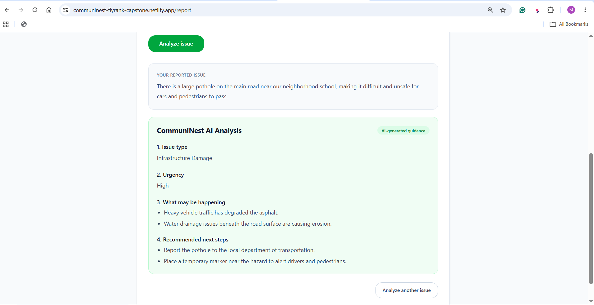
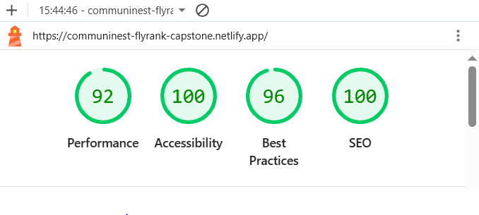
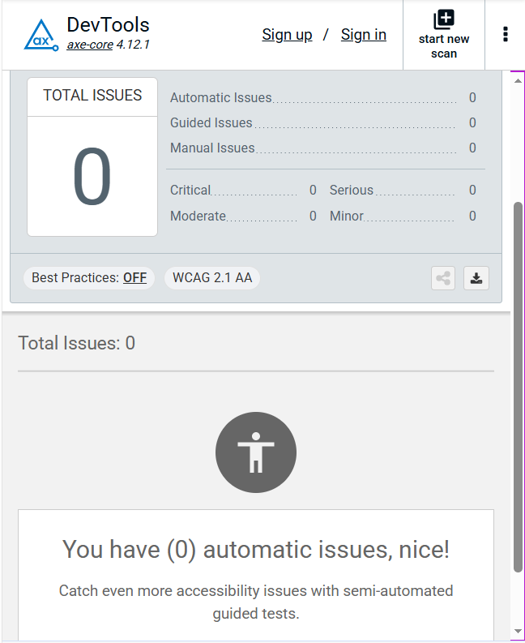

# CommuniNest — FlyRank Frontend AI Capstone

CommuniNest is a community-focused AI web application that helps people report and understand local community issues.

A user can describe a problem in their neighborhood, and CommuniNest uses an AI-powered analysis flow to identify the likely issue type, assess its urgency, explain what may be happening, and suggest practical next steps.

The project was built as the final capstone for the **FlyRank AI Engineering Frontend track**, with a focus on building a complete, accessible, tested, resilient, and publicly deployed frontend application.

## Live Demo

**Production:** https://communinest-flyrank-capstone.netlify.app/

**Repository:** https://github.com/abdullahcodes-dev/FlyrankFrontendCapstone

The application is deployed on Netlify and connected to the GitHub repository. Pushes to the `main` branch trigger production deployments.

## Screenshots

### Homepage



### Issue Reporting



### AI-Powered Analysis



### Lighthouse Quality Audit



Latest desktop Lighthouse run:

| Category       |   Score |
| -------------- | ------: |
| Performance    |  **92** |
| Accessibility  | **100** |
| Best Practices |  **96** |
| SEO            | **100** |

### Accessibility Audit



The final axe DevTools automated scan reported **0 automatic accessibility issues**, including zero critical, serious, moderate, and minor issues.

## What CommuniNest Does

CommuniNest is designed around a simple community problem: people often notice local issues but may not know how to describe them, how urgent they are, or what they can practically do next.

The application provides:

- A community-focused homepage
- Information about CommuniNest and its purpose
- Community features and initiatives
- Volunteer and community event sections
- An issue-reporting workflow
- AI-powered analysis of reported issues
- Structured guidance based on the submitted issue
- Loading, success, and error states
- Responsive layouts for desktop and mobile users
- Accessible navigation and form interactions

## Key Feature: AI Issue Analysis

The primary AI capability is integrated directly into the **Report an Issue** workflow rather than being presented as a standalone chatbot.

A user describes a community problem and submits it for analysis.

The frontend sends the request to:

`POST /api/analyze`

The server-side route validates the submitted issue before sending it to the Google Gemini API.

The AI response is constrained to a predictable structure containing:

1. **Issue Type** — a general category for the reported problem
2. **Urgency** — `Low`, `Medium`, or `High`
3. **What May Be Happening** — 2–4 plausible explanations
4. **Recommended Next Steps** — 2–4 practical actions

The API also validates the returned structure before sending it back to the frontend. Invalid or empty AI responses are treated as failures rather than being displayed as if they were valid analysis.

## Architecture Overview

CommuniNest uses the **Next.js App Router** architecture.

```text
app/
├── api/
│   └── analyze/
│       └── route.ts
├── components/
│   └── Navbar.tsx
├── about/
│   └── page.tsx
├── events/
│   └── page.tsx
├── features/
│   └── page.tsx
├── health/
│   └── page.tsx
├── report/
│   └── page.tsx
├── volunteers/
│   └── page.tsx
├── globals.css
├── layout.tsx
└── page.tsx
```

### Root Layout

`app/layout.tsx`

Provides the shared application shell, including:

- Global fonts
- Global CSS
- Metadata
- Shared navigation
- Root HTML/body structure

### Navigation

`app/components/Navbar.tsx`

Provides:

- Desktop navigation
- Responsive mobile navigation
- Accessible menu controls
- Navigation links to the main application sections

### Report Workflow

`app/report/page.tsx`

Contains the primary user-facing AI workflow:

- Issue input
- Minimum character validation
- Character counter
- Analyze action
- Loading state
- Successful analysis display
- Error handling

### AI API Route

`app/api/analyze/route.ts`

The server-side route:

1. Parses the incoming request
2. Validates the request structure
3. Trims the submitted issue
4. Enforces a minimum length of 20 characters
5. Enforces a maximum length of 2,000 characters
6. Sends the issue to Google Gemini
7. Requests structured JSON output
8. Validates the returned analysis
9. Returns the structured result to the frontend
10. Returns a safe error response when analysis fails

The Gemini API request is kept server-side so the API credential is not exposed to the browser.

## Application Routes

| Route          | Purpose                          |
| -------------- | -------------------------------- |
| `/`            | Main CommuniNest homepage        |
| `/about`       | About CommuniNest                |
| `/features`    | Application features             |
| `/report`      | AI-powered issue reporting       |
| `/events`      | Community events                 |
| `/volunteers`  | Volunteer opportunities          |
| `/health`      | Application health-check route   |
| `/api/analyze` | Server-side AI analysis endpoint |

## Tech Stack

- **Next.js 16**
- **React 19**
- **TypeScript**
- **Tailwind CSS 4**
- **Google Gemini API**
- **Vitest**
- **Testing Library**
- **ESLint**
- **Netlify**
- **GitHub**

## Environment Variables

Create a `.env.local` file in the project root for local development.

| Variable           | Required | Purpose                                                |
| ------------------ | -------- | ------------------------------------------------------ |
| `GEMINI_API_KEY`   | Yes      | Server-side Google Gemini API authentication           |
| `HEALTH_CHECK_URL` | Yes      | URL used by the application health-check configuration |

Example:

```env
GEMINI_API_KEY=your_gemini_api_key_here
HEALTH_CHECK_URL=https://jsonplaceholder.typicode.com/todos/1
```

**Never commit `.env.local` or real API credentials to the repository.**

The repository includes `.env.example` to document the environment configuration without exposing secret values.

## Getting Started

### Prerequisites

- Node.js
- npm
- A Google Gemini API key for the AI analysis functionality

### Install dependencies

```bash
npm install
```

### Configure environment variables

Create `.env.local` and add the required variables described above.

### Start the development server

```bash
npm run dev
```

Open:

```text
http://localhost:3000
```

### Run the production build

```bash
npm run build
```

### Start the production server locally

```bash
npm start
```

## Testing

The project uses **Vitest** and **Testing Library** for automated testing.

The current test suite focuses on the critical report-page workflow.

### Current Tests

The report page has three passing tests covering:

1. The Analyze button remains disabled until the issue reaches the required minimum length.
2. A successful AI request displays the returned analysis.
3. A failed AI request displays an appropriate error message.

Run the tests with:

```bash
npm test -- --run
```

### Coverage

The latest coverage run reported:

| Metric     |   Coverage |
| ---------- | ---------: |
| Statements | **81.25%** |
| Branches   | **85.00%** |
| Functions  | **83.33%** |
| Lines      | **83.87%** |

Run coverage with:

```bash
npm test -- --run --coverage
```

## Accessibility

Accessibility was treated as part of the implementation rather than only as a final audit.

The application was tested using **axe DevTools** against WCAG 2.1 AA rules.

The initial automated scan identified four serious color-contrast issues. The affected colors were adjusted, after which a subsequent full-page scan reported:

- Automatic issues: **0**
- Critical: **0**
- Serious: **0**
- Moderate: **0**
- Minor: **0**

Additional accessibility considerations include:

- Semantic HTML
- Navigation landmarks
- Accessible mobile menu controls
- Descriptive ARIA labels where appropriate
- Visible keyboard focus states
- Form validation feedback
- Responsive layouts
- WCAG-compliant color contrast

## Performance

The production application was audited using Lighthouse.

Latest desktop results:

| Category       |   Score |
| -------------- | ------: |
| Performance    |  **92** |
| Accessibility  | **100** |
| Best Practices |  **96** |
| SEO            | **100** |

The Lighthouse run also surfaced browser-environment-related performance diagnostics. These were reviewed separately from the overall quality scores.

The project prioritizes shipping a functional, accessible, tested production application while avoiding unnecessary optimization work that would add complexity without meaningful user benefit.

## Production Hygiene & Resilience

The AI endpoint includes basic protection against oversized or trivial requests.

The report input is constrained to:

- **Minimum:** 20 characters
- **Maximum:** 2,000 characters

The same validation is enforced server-side in `/api/analyze`, so the protection does not rely only on frontend UI behavior.

The endpoint also validates:

- Request JSON structure
- Issue type
- Urgency values
- Number and type of generated explanations
- Number and type of recommended next steps

This prevents malformed AI output from being treated as a valid application response.

The application also handles:

- Invalid request bodies
- Insufficient input
- Oversized input
- Empty AI responses
- Invalid AI JSON
- Invalid AI response structures
- AI service failures

Users receive a safe, user-facing error message when the AI service cannot complete the request.

## Technical Decisions

### Server-side AI integration

The Gemini request is performed from the Next.js server-side route instead of directly from the browser.

This keeps the API key away from client-side JavaScript and gives the application a single place to validate requests and AI responses.

### Structured AI output

The AI request uses a JSON response schema instead of relying on free-form text.

This makes the response predictable for the React UI and allows the server to validate the generated structure before returning it.

### Input limits

The report workflow uses both frontend and server-side input limits.

The frontend provides immediate feedback to the user, while the server independently enforces the same constraints.

### Explicit error states

AI-dependent interfaces can fail for reasons outside the application's control. Instead of leaving the user with a broken or ambiguous state, the report workflow provides explicit loading and error handling.

### Keep the scope focused

CommuniNest is intentionally scoped as a capstone application rather than a full civic platform.

The goal was to demonstrate a complete frontend product workflow with meaningful AI integration, rather than introduce authentication, databases, municipal integrations, or other infrastructure that was not necessary for the core experience.

## Deployment

CommuniNest is deployed to **Netlify** and connected to the GitHub repository.

The `main` branch is used for production deployments.

The latest production deployment was verified after the final accessibility, testing, and documentation work.

The production environment contains the required AI API configuration without exposing credentials in the repository.

Netlify's current Next.js runtime supports the Next.js App Router and Route Handlers used by this project.

## Production Verification

The final production version was verified for:

- Homepage loading
- Navigation
- About page
- Features page
- Events page
- Volunteers page
- Report workflow
- AI analysis
- Input validation
- AI error handling
- Responsive behavior
- Accessibility
- Production build
- Automated tests
- Lighthouse quality

## Known Limitations

CommuniNest is intentionally scoped as a small capstone application.

Current limitations include:

- No user authentication
- No persistent database for submitted reports
- Reports are analyzed but are not submitted directly to municipal authorities
- AI-generated guidance should be treated as informational rather than official civic advice
- The application does not independently verify the real-world condition described by a user
- Community events and volunteer content are currently application-level content rather than a complete user-generated platform
- The AI workflow depends on availability of the configured external AI service
- Automated testing currently focuses primarily on the core report workflow rather than the entire application

These are deliberate scope decisions for the capstone.

## Future Improvements

Potential future development could include:

- User accounts and authentication
- Persistent issue reporting
- Issue status tracking
- Location-based issue reporting
- Image uploads for reported problems
- Community voting and verification
- Municipal or organization integrations
- Notifications for issue updates
- Moderation workflows
- AI-assisted duplicate issue detection
- Expanded end-to-end testing
- Further performance optimization as the application grows

## How AI Tools Were Used

AI tools were used throughout development as **development assistants**, not as a replacement for testing or engineering judgment.

AI assistance was used for tasks including:

- Exploring implementation approaches
- Generating and refining React/Next.js components
- Debugging TypeScript and JSX issues
- Improving responsive navigation behavior
- Reviewing accessibility problems
- Interpreting Lighthouse and axe DevTools findings
- Improving the AI API's validation and error handling
- Designing and refining automated tests
- Reviewing test coverage
- Structuring documentation and README content

The development process still required manual integration and verification. Generated code was reviewed, adapted to the existing project, tested locally, checked with browser tools, and verified again on the production deployment.

For the AI-powered product feature itself, Google Gemini is the external AI service used by the application. The model is instructed to return structured issue analysis rather than unrestricted conversational output.

## Production Checklist

- [x] Public production deployment
- [x] Main user flows verified
- [x] AI capability integrated into the product workflow
- [x] AI API key kept server-side
- [x] Server-side input validation
- [x] 20–2,000 character input cap
- [x] AI response validation
- [x] AI error handling
- [x] Automated tests passing
- [x] Test coverage above 50%
- [x] Production build succeeds
- [x] Lighthouse audit completed
- [x] Accessibility audit completed
- [x] axe DevTools reports zero automatic issues
- [x] Environment configuration documented
- [x] Production deployment verified
- [x] README documents architecture and technical decisions
- [x] AI-assisted development process documented

## Capstone Reflection

CommuniNest evolved from an initial application scaffold into a publicly deployed AI-powered community application.

The final implementation focuses on the complete user journey: describing a community issue, validating the input, analyzing it through an AI-backed server route, presenting structured guidance, handling failures gracefully, and delivering the experience through a production deployment.

The project also provided practical experience with accessibility auditing, automated testing, performance analysis, server-side AI integration, environment management, Git-based deployment, and production-oriented documentation.

---

**Built as part of the FlyRank AI Engineering Frontend Capstone — 2026.**
